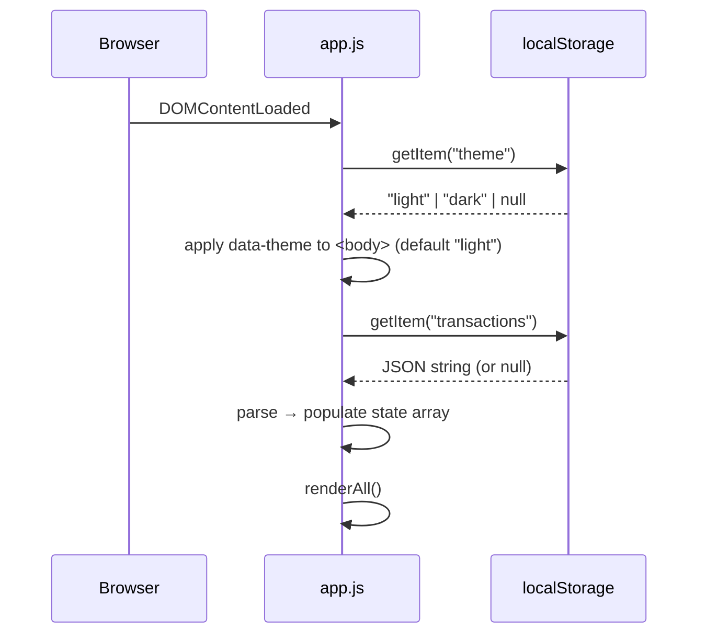

# Design Document

## Overview

The Expense Tracker is a single-page, client-side web application built with plain HTML, CSS, and vanilla JavaScript. There is no backend, no build step, and no framework. The user opens `index.html` directly in a browser and the app is fully functional.

The app lets users:
- Add transactions (name, amount, category)
- View a scrollable list of all transactions with per-item delete
- See a live-updating total balance
- See a pie chart (Chart.js via CDN) of spending by category
- Have all data automatically persisted to `localStorage`

The entire application state lives in a single in-memory array of transaction objects. Every mutation (add / delete) triggers a full re-render of the list, balance, and chart, then flushes state to `localStorage`.

---

## Architecture

The app follows a simple unidirectional data flow:

```
User Action
    │
    ▼
State Mutation (addTransaction / deleteTransaction)
    │
    ▼
Persist to localStorage
    │
    ▼
Re-render UI (list + balance + chart)
```

All logic lives in a single JS file (`js/app.js`). There are no modules, no bundler, and no dynamic imports — just a script tag at the bottom of `<body>`.

### File Structure

```
index.html
css/
  style.css
js/
  app.js
```

### Initialization Sequence



---

## Components and Interfaces

### 1. Input Form (`#expense-form`)

HTML fields:
- `#item-name` — text input, required
- `#amount` — number input, required, min > 0
- `#category` — select with options: Food, Transport, Fun

Behavior:
- On submit: validate → create transaction object → `addTransaction(tx)` → `renderAll()` → clear form
- Validation errors are shown in a `#form-error` element

### 2. Transaction List (`#transaction-list`)

- Renders one `<li>` per transaction
- Each item shows: name, formatted amount, category badge, delete button
- The `<ul>` has `overflow-y: auto` and a fixed `max-height` for scrollability
- Delete button calls `deleteTransaction(id)` → `renderAll()`

### 3. Balance Display (`#balance`)

- A single `<span>` updated on every `renderAll()` call
- Value = `state.transactions.reduce((sum, tx) => sum + tx.amount, 0)`

### 4. Pie Chart (`#expense-chart`)

- `<canvas id="expense-chart">` rendered by Chart.js (loaded via CDN)
- Chart instance stored in `state.chart`
- On each `renderAll()`: if no transactions → destroy chart and show `#chart-placeholder`; otherwise create/update chart with aggregated category totals
- Colors: Food = `#FF6384`, Transport = `#36A2EB`, Fun = `#FFCE56`

### 5. Storage Module (inline in `app.js`)

Two functions:
- `saveToStorage(transactions)` — `localStorage.setItem("transactions", JSON.stringify(transactions))`
- `loadFromStorage()` — `JSON.parse(localStorage.getItem("transactions") || "[]")`, wrapped in try/catch

### 6. State Object

```js
const state = {
  transactions: [],  // Transaction[]
  chart: null,       // Chart.js instance or null
  sortOrder: "default" // "default" | "amount-asc" | "amount-desc" | "category-asc"
};
```

### 7. Theme Toggle (header button)

A `<button id="theme-toggle">` placed in the page header (outside `<main>`).

Behavior:
- On click: read current `data-theme` on `<body>`, toggle to the opposite value, persist to `localStorage` under key `"theme"`, update button label/icon
- On `DOMContentLoaded`: read `localStorage.getItem("theme")` (default `"light"` if absent), set `document.body.dataset.theme` before `renderAll()`

CSS:
- `style.css` defines CSS custom properties (`--bg`, `--surface`, `--text`, etc.) scoped to `[data-theme="light"]` and `[data-theme="dark"]` selectors
- All color values in the stylesheet reference these variables — no JS color manipulation

### 8. Monthly Summary (`#monthly-summary`)

A `<section id="monthly-summary">` rendered below the chart section.

Behavior:
- `renderMonthlySummary()` is called inside `renderAll()` after `renderChart()`
- Groups transactions by `"YYYY-MM"` derived from `tx.date` (ISO string) for new transactions, or from `new Date(parseInt(tx.id)).toISOString()` for legacy transactions that have no `date` field
- For each month group, renders: month label (e.g. "July 2025"), total spent, and per-category breakdown (Food / Transport / Fun)
- If no transactions: renders an empty-state message inside `#monthly-summary`

### 9. Sort Controls (`#sort-select`)

A `<div class="sort-controls">` placed above `#transaction-list` inside the list section.

HTML:
```html
<select id="sort-select">
  <option value="default">Default (date added)</option>
  <option value="amount-asc">Amount: Low → High</option>
  <option value="amount-desc">Amount: High → Low</option>
  <option value="category-asc">Category: A → Z</option>
</select>
```

Behavior:
- `change` event on `#sort-select`: set `state.sortOrder = e.target.value`, call `renderAll()`
- `renderList()` derives a sorted copy of `state.transactions` before rendering — `state.transactions` itself is never reordered
- Sort logic:
  - `"default"` → original insertion order
  - `"amount-asc"` → ascending by `tx.amount`
  - `"amount-desc"` → descending by `tx.amount`
  - `"category-asc"` → alphabetical by `tx.category`

---

## Data Models

### Transaction

```js
{
  id: string,        // Date.now().toString() — doubles as a timestamp for legacy month derivation
  name: string,      // non-empty item name
  amount: number,    // positive number (e.g. 12.50)
  category: string,  // "Food" | "Transport" | "Fun"
  date: string       // ISO 8601 string from new Date().toISOString() — added for new transactions (Req 8)
}
```

> Legacy transactions (created before Requirement 8) have no `date` field. `renderMonthlySummary()` falls back to `new Date(parseInt(tx.id)).toISOString()` to derive the month for those records.

### localStorage Schema

Key: `"transactions"`  
Value: JSON-serialized `Transaction[]`

```json
[
  { "id": "1720000000000", "name": "Lunch", "amount": 12.5, "category": "Food", "date": "2025-07-03T12:00:00.000Z" },
  { "id": "1720000001000", "name": "Bus", "amount": 2.0, "category": "Transport", "date": "2025-07-03T12:00:01.000Z" }
]
```

Key: `"theme"`  
Value: `"light"` or `"dark"` (string)

### Category Aggregation (for chart)

```js
// Computed on each render, not stored
{
  Food: number,
  Transport: number,
  Fun: number
}
```

### Monthly Aggregation (for monthly summary)

```js
// Computed on each render by renderMonthlySummary(), not stored
{
  "YYYY-MM": {
    total: number,
    Food: number,
    Transport: number,
    Fun: number
  }
}
```

---

## Correctness Properties

*A property is a characteristic or behavior that should hold true across all valid executions of a system — essentially, a formal statement about what the system should do. Properties serve as the bridge between human-readable specifications and machine-verifiable correctness guarantees.*

### Property 1: Valid transaction add round-trip

*For any* valid transaction (non-empty name, positive amount, valid category), after calling `addTransaction`, the transaction list should contain that transaction and `localStorage` should contain a JSON array that includes it.

**Validates: Requirements 1.2, 5.1**

---

### Property 2: Invalid input is rejected

*For any* form submission where the name is empty, the amount is non-positive or non-numeric, or the category is missing, the transaction list length should remain unchanged and no new entry should appear in `localStorage`.

**Validates: Requirements 1.3, 1.4**

---

### Property 3: Form is cleared after successful add

*For any* valid transaction added via the form, all form fields (name, amount, category) should be reset to their default/empty values after the add completes.

**Validates: Requirements 1.5**

---

### Property 4: List renders all transactions

*For any* array of transactions in state, every transaction's name, amount, and category should appear in the rendered `#transaction-list` DOM.

**Validates: Requirements 2.1**

---

### Property 5: Delete removes transaction from list and storage

*For any* transaction present in the list, after calling `deleteTransaction(id)`, that transaction's id should not appear in the rendered list and `localStorage` should not contain an entry with that id.

**Validates: Requirements 2.3, 5.1**

---

### Property 6: Balance equals sum of all amounts

*For any* set of transactions, the value displayed in `#balance` should equal the arithmetic sum of all transaction amounts (and should be 0 when the list is empty).

**Validates: Requirements 3.1, 3.2, 3.3**

---

### Property 7: Chart data matches category aggregation

*For any* set of transactions, the data values passed to the Chart.js instance should equal the sum of amounts for each category (Food, Transport, Fun) computed from the current transaction array.

**Validates: Requirements 4.1, 4.2, 4.3**

---

### Property 8: Load from storage round-trip

*For any* array of transactions written to `localStorage`, after calling the initialization routine, the in-memory state, rendered list, and displayed balance should all match what was stored.

**Validates: Requirements 2.4, 5.2**

---

### Property 9: Empty state shows placeholder (edge case)

*When* the transaction array is empty, the `#chart-placeholder` element should be visible and no Chart.js canvas should be rendered.

**Validates: Requirements 4.4**

---

### Property 10: Corrupt storage falls back gracefully (edge case)

*When* `localStorage` contains a non-parseable value for the transactions key, the app should initialize with an empty transaction array and display a warning message to the user.

**Validates: Requirements 5.3**

---

### Property 11: Theme toggle applies data-theme attribute

*For any* current theme value on `<body>`, activating the theme toggle should set `document.body.dataset.theme` to the opposite value ("light" ↔ "dark").

**Validates: Requirements 7.1, 7.2**

---

### Property 12: Theme persistence round-trip

*For any* theme value ("light" or "dark") applied via the toggle, writing to `localStorage` and then re-reading it during initialization should result in `document.body.dataset.theme` matching the stored value.

**Validates: Requirements 7.3, 7.4**

---

### Property 13: Monthly summary groups match transaction months

*For any* array of transactions, the set of month keys rendered in `#monthly-summary` should equal exactly the set of distinct `"YYYY-MM"` values derived from each transaction's `date` field (or `id`-based fallback).

**Validates: Requirements 8.1, 8.2, 8.3**

---

### Property 14: Monthly totals are correct

*For any* array of transactions, for each month group rendered in `#monthly-summary`, the displayed total and per-category amounts should equal the arithmetic sums of the corresponding transaction amounts in that month.

**Validates: Requirements 8.2, 8.3**

---

### Property 15: Sort renders list in correct order

*For any* array of transactions and any sort option ("default", "amount-asc", "amount-desc", "category-asc"), the order of items rendered in `#transaction-list` should match the expected comparator for that option.

**Validates: Requirements 9.1, 9.2, 9.5**

---

### Property 16: Sort does not mutate storage

*For any* array of transactions and any sort option applied, the order of entries in `localStorage["transactions"]` should remain unchanged (insertion order) after sorting.

**Validates: Requirements 9.3**

---

## Error Handling

| Scenario | Handling |
|---|---|
| Empty name field on submit | Show `#form-error`, abort save |
| Amount ≤ 0 or non-numeric on submit | Show `#form-error`, abort save |
| Category not selected on submit | Show `#form-error`, abort save |
| `localStorage` unavailable (SecurityError) | Catch in `loadFromStorage`, use empty array, show warning banner |
| `localStorage` contains invalid JSON | Catch `JSON.parse` error, use empty array, show warning banner |
| `deleteTransaction` called with unknown id | No-op (filter produces same array) |
| Chart.js CDN fails to load | `window.Chart` is undefined; skip chart render, show placeholder |
| `localStorage["theme"]` missing on load | Default to `"light"` theme silently |
| Transaction has no `date` field (legacy) | Fall back to `new Date(parseInt(tx.id))` for month derivation in `renderMonthlySummary()` |
| `tx.id` is not a valid timestamp integer | `new Date(NaN)` produces "Invalid Date"; group under `"unknown"` month label |

Error messages are displayed in:
- `#form-error` — inline below the form for validation errors
- `#storage-warning` — a dismissible banner at the top of the page for storage errors

---

## Testing Strategy

### Dual Testing Approach

Both unit tests and property-based tests are required. They are complementary:
- Unit tests cover specific examples, integration points, and edge cases
- Property tests verify universal correctness across randomized inputs

### Unit Tests (specific examples and edge cases)

- Form renders with correct fields and options (Requirement 1.1)
- Submitting a known transaction produces the expected list item HTML
- Deleting the only transaction leaves an empty list and zero balance
- Corrupt localStorage string triggers warning and empty state (Requirement 5.3)
- Empty transaction array shows `#chart-placeholder` (Requirement 4.4)
- Chart.js unavailable: chart render is skipped without throwing
- Theme toggle button exists in the DOM (Requirement 7.1)
- No theme in localStorage defaults to "light" on init (Requirement 7.5)
- Empty transaction array shows empty-state message in `#monthly-summary` (Requirement 8.6)
- Sort select element exists with all four options (Requirement 9.1)

### Property-Based Tests

Use a property-based testing library appropriate for vanilla JS — **fast-check** (loaded via CDN or npm in the test environment).

Each property test must run a minimum of **100 iterations**.

Each test must include a comment tag in the format:
`// Feature: vanilla-web-app, Property N: <property text>`

| Property | Test Description |
|---|---|
| Property 1 | Generate random valid transactions; verify add round-trip to list + localStorage |
| Property 2 | Generate invalid inputs (empty name, zero/negative/NaN amount); verify list unchanged |
| Property 3 | Generate valid transactions; verify all form fields empty after add |
| Property 4 | Generate random transaction arrays; verify all items appear in rendered list |
| Property 5 | Generate transaction arrays; pick random item to delete; verify removal from list + localStorage |
| Property 6 | Generate random transaction arrays; verify `#balance` text equals computed sum |
| Property 7 | Generate random transaction arrays; verify chart data values equal per-category sums |
| Property 8 | Write random transactions to localStorage; re-init; verify state + list + balance match |
| Property 11 | Generate random current theme; activate toggle; verify `data-theme` flips to opposite value |
| Property 12 | Write random theme to localStorage; re-init; verify `data-theme` on body matches stored value |
| Property 13 | Generate random transaction arrays; verify rendered month keys equal distinct YYYY-MM values |
| Property 14 | Generate random transaction arrays; verify per-month totals and per-category amounts equal computed sums |
| Property 15 | Generate random transaction arrays and random sort option; verify rendered list order matches comparator |
| Property 16 | Generate random transaction arrays; apply any sort; verify localStorage order is unchanged |

Each correctness property must be implemented by a **single** property-based test.
